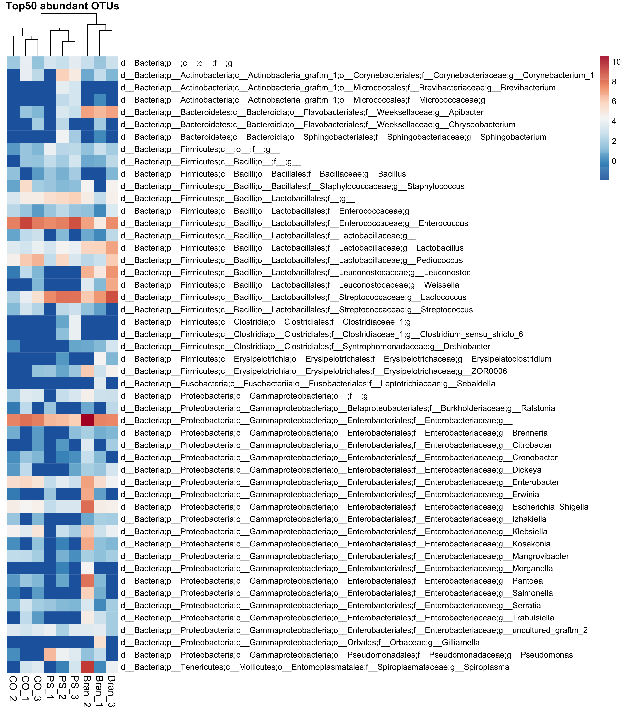

# Abstract 

Polystyrene is a widely used organic polymer that is cheap, strong and, unfortuantely, incredibly difficult to break down. In this study *Zophobas morio* ("Superworms") is evaluated as a candidate to naturally degrade polystyrene, with some promising results. 

With the goal of finding a sustainabable method to break down Polystyrene, three groups of works were raised on three diets (Bran, Polystyrene, Starvation) over a period of three weeks and their gut microbiome subsequently analysed with interesting results. The proportion of microbes compared to the host cells in the gut after the trial showed very little difference between the three groups, suggesting the superworm gut microbiome is highly adaptable to an unnatural diet. Metagenomic analysis showed diversity was reduce for both the polystyrene and starvation group.

Weight gain was signficantly reduced in the polystyrene group. Some weight gain indicates the Superworms are able to derive some energy from the polystyrene, although clearly it is suboptimal diet.

Definitions:
Polystyrene: PS
Starvation: CO
Bran: Bran

# Introduction

Most plastics are composed of hydrocarbons - organic compounds made from hydrogen and carbon. Propylene is one common source. Another is styrene, used in the production of polystyrene. Naturally occuring bacteria have evolved machinery over millions of years to be able to degrade carbohydrates and proteins found in nature (cellulose, various fats and sugars). Plastics, in constrast, are formed from from very stable carbon-carbon bonds not often found in nature. As such, enzymes and other cellular machinery has not evolved to break those down, resulting in large amounts of waste plastic that cannot be naturally disposed. 

This lack of biodegradabilty, along with our growing population and addition to inexpensive and long lasting plastic products has led to a renewed effort in recent years to find natural ways to break down a wholly unnatural product.

There has been some notable progress in this area. *Klebsiella pneumoniae* and *Rhodococcus sp.* have been shown to promote degredation of Polyethylene(PE) and Pseudomonas citronellolis and Bacillus flexus for Polyvinyl chloride (PVC) (Atanasova, 2021). Polyethylene, and subequently, polystyrene, thought to be non biodegradable, was shown to have improved biodegredation when exposed to a biofilm producing strain of Rhodococcus ruber (Mor, 2008). More recently, *Enterobacter asburiae YT1* and *Bacillus sp* isolated from the gut of waxworms was shown to be capable of degrading PE (Yang, 2014) and Pseudomonas, Rhodococcus and Corynebacterium are shown to improve Polystyrene degredation (Sun, 2022).

# Materials and Methods

**Gene Centric**
The genomic sequencing was carried out with the Illumina NextSeq 500 platform, generating 2 x 150bp, pair ended reads. Quality control was performed with FastQC 0.11.9. For this paper, a subset of reads was used, 10000 reads per sample, across 9 samples (3 CO, 3 Bran, 3 PS). A combination of read mapping using bwa and exclusion using samtools was used to find the ratio of host to microbial reads in the samples.

After excluding the host reads, 16S rRNA genes were used to classify the bacteria into taxa using the GraftM tool and OTU set from the silva SSU database. Using the taxonomic data, the Shannon and Simpson diversity was calculated and plotted using R with the phyloseq and ggplot libraries.

To simplify and establish variance in the dataset, we used a scree plot and then did PCA to find patterns in the OTUs. This paper focuses on a subset of the full dataset, which has a far lower species count, so it could be argued PCA is less useful here - however a real world dataset could contains many thousands of taxa, so it is well worth considering PCA.

A heatmap showing the relative abundance of the community for each sample was generated. Finally, we ran a differential abundance analysis using DESeq2. This shows the difference in abundance for each variable (in this case, taxa basd on the OTU set we created). The change in abundance was normalized using log2 fold change. Log values are used to normalize the values. Log2 is a particularly good choice since it is more bioloigically intuitive; a change of 1 means doubling, and -1 means halving. 

**Genomic Centric**
Functional analysis was also performed. Proteins in the assembled sequences were identified and classified using KEGG Orthology and the DIAMOND tool. R and the DESeq2 package was then used to do a differential analysis. The KO table was normalised the account for sequencing depth to avoid bias.

In addition to the data from the three groups of superworms, additional data was added for the functional analysis: faeces samples from the superworms in the polystyrene and the bran group.

To simplify and establish variance in the dataset, we used a scree plot and then did PCA to find patterns in the OTUs.

The Bran group has an average of 71.93% non host reads and PS group has an average of 72.57%. This compares to the Starvation group which has an average of 73.82%. This means the Starvation group has a lower amount of worm cells (the host) in the gut. suggest that the Starvation group may be adapting to a lack of food by shedding less of the gut wall, perhaps in an effort to maintain vital nutrients due to a lack of food (new resources).

**Remove host reads from samples**

This table show the percent of non host reads for each sample, averaged across three samples for each category.

| Sample | Non host average |
|---|---|
| Bran | 71.93% |
| PS | 72.57% |
| CO | 73.82% |

The below stacked graph shows the proportion of host reads compared to microbial reads. Although the Bran group shows the highest host reads, followed by PS and CO in last place, the overall difference is minimal. Although this doesn't speak to the relative abundance of microbes, it shows the ratios are relatively stable, comparing a natural diet of bran, what you would expect to be a poor diet of polystyrene, and no diet at all. This suggests the gut microbiome of superworms is highly resilient to a sudden change in diet.

<!--  -->
PUIT ACK

Now we will analyze the diversity using the Shannon and Simpson indices. The absolute abundance of microbes does not seem to change substantially based on diet, but how about the relative abundance in each of those communities? 

The below box plot shows the Shannon and Simpson Diversity:

The Shannon Index accounts for both abundance (the number of individuals per species) and evenness (how evenly said individuals are distributed among the species). The Simpon Index emphasises the dominance of a species.

As the box plots for the Shannon Index show, it is clear that any diet is better than no diet when it comes to diversity. The starvation group exhibit a compressed interquartile range and median for the Shannon Index. The PS group diveristy suffers, too, but perhaps less than expected. This implies the bacteria is able to adapt to a new diet quickly and break down polystyrene - great news.

The Simpons Index gives us a different perspective. Higher values mean the dominant species is less represented than if the value was lower. The compressed interquartile range show that in the PS group, while some species are more dominant under a PS diet (likely the ones that are able to consume and thrive on polystyrene), generally speaking the median value is comparable to the Bran group. The microbes appear to be highly adaptable, able to maintain a comparable level of diversity despite a sudden change in diet.

The diversity plummets in the CO group - likely the bacteria that are most able to either sustain themselves with little sustanance, or consume host cells more effectively, are dominanting the community.

This heatmap of this distance matrix gives us an overview over similarities and dissimilarities between samples.

This aligns with what we suspect so far. The dendogram groups the PS an CO groups first, with the Bran group last. Both the PS and CO groups have impaired microbiomes. Within each cluster, each all three samples are grouped together, indicating little variation between the each sample within a given group.

<!--  -->

<!-- Q: Which taxa are highly abundant across all samples? Can you find taxa that are more abundant in any of the sample types? -->

**Differential Abundance**

This figure shows the most statistically significant log2 fold change in abundance between the PS and Bran group.

The taxa with a blue (positive) log2 fold change value are more abundant in the PS group; red are less abundant.

Leuconostoc and Weissella are have a high log2 fold change; they are much more abundant in the Bran group. Both belong to the Lactobacillaceae family. This suggests those bacteria are in some way involved in breaking down Bran, but not polystyrene. One possibility is they produce an enzyme that breaks down cellulose.

The two species with the lowest log2 fold change are *corynebacterium* and *pseudomonas*. It is possible the polystyrene creates an environment that promotes growth of these species, such as a change in pH or moisture.  Another exciting possibility is those bacteria play a role in the biodegradation of polystyrene.

<!-- Q1: Which taxa are significantly more abundant in PS compared to bran? 

Q2: Which are significantly more abundant in PS compared to the
starvation group? 

Q3: Are there any taxa that are always more abundant in the PS group? -->

Sun, J., Prabhu, A., Aroney, S. T., & Rinke, C. (2022). Insights into plastic biodegradation: community composition and functional capabilities of the superworm (Zophobas morio) microbiome in styrofoam feeding trials. Microbial genomics, 8(6), 000842.

Atanasova, N., Stoitsova, S., Paunova-Krasteva, T., & Kambourova, M. (2021). Plastic degradation by extremophilic bacteria. International Journal of Molecular Sciences, 22(11), 5610.

Mor, R., & Sivan, A. (2008). Biofilm formation and partial biodegradation of polystyrene by the actinomycete Rhodococcus ruber: biodegradation of polystyrene. Biodegradation, 19(6), 851–858. https://doi.org/10.1007/s10532-008-9188-0

Yang, J., Yang, Y., Wu, W. M., Zhao, J., & Jiang, L. (2014). Evidence of polyethylene biodegradation by bacterial strains from the guts of plastic-eating waxworms. Environmental science & technology, 48(23), 13776–13784. https://doi.org/10.1021/es504038a