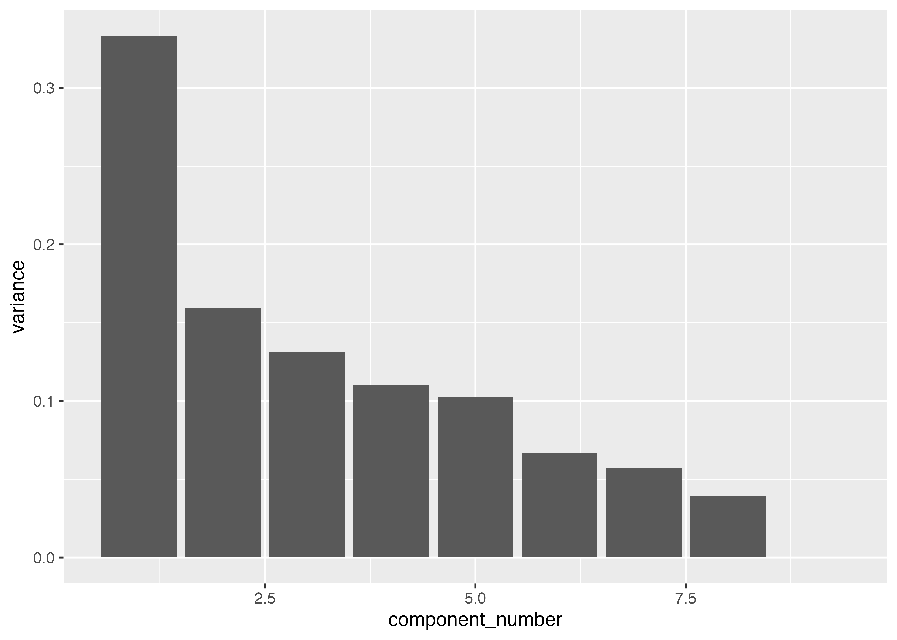

# Abstract 

Polystyrene is a widely used organic polymer that is cheap, strong and, unfortunately, incredibly difficult to break down. In this study *Zophobas morio* ("Superworms") is evaluated as a candidate to naturally degrade polystyrene, with some promising results. 

With the goal of finding a sustainable method to break down Polystyrene, three groups of works were raised on three diets (Bran, Polystyrene, Starvation) over a period of three weeks and their gut microbiome subsequently analysed with interesting results. The proportion of microbes compared to the host cells in the gut after the trial showed very little difference between the three groups, suggesting the superworm gut microbiome is highly adaptable to an unnatural diet. Metagenomic analysis showed diversity was reduce for both the polystyrene and starvation group.

Weight gain was significantly reduced in the polystyrene group. Some weight gain indicates the Superworms are able to derive some energy from the polystyrene, although clearly it is suboptimal diet.

Definitions: Polystyrene, PS; Starvation, CO

# Introduction

Most plastics are composed of hydrocarbons - organic compounds made from hydrogen and carbon. Propylene is one common source. Another is styrene, used in the production of polystyrene. Naturally occurring bacteria have evolved machinery over millions of years to be able to degrade carbohydrates and proteins found in nature (cellulose, various fats and sugars). Plastics, in contrast, are formed from from very stable carbon-carbon bonds not often found in nature. As such, enzymes and other cellular machinery has not evolved to break those down, resulting in large amounts of waste plastic that cannot be naturally disposed. 

This lack of biodegradability, along with our growing population and addition to inexpensive and long lasting plastic products has led to a renewed effort in recent years to find natural ways to break down a wholly unnatural product.

There has been some notable progress in this area. *Klebsiella pneumoniae* and *Rhodococcus sp.* have been shown to promote degradation of Polyethylene(PE) and *Pseudomonas citronellolis* and *Bacillus flexus* for Polyvinyl chloride (PVC) (Atanasova, 2021). Polyethylene, and subsequently, polystyrene, thought to be non biodegradable, was shown to have improved biodegradation when exposed to a biofilm producing strain of *Rhodococcus ruber* (Mor, 2008). More recently, *Enterobacter asburiae YT1* and *Bacillus sp* isolated from the gut of waxworms was shown to be capable of degrading PE (Yang, 2014) and *Pseudomonas*, *Rhodococcus* and *Corynebacterium* are shown to improve Polystyrene degradation (Sun, 2022).

# Materials and Methods

The genomic sequencing was carried out with the Illumina NextSeq 500 platform, generating 2 x 150bp, pair ended reads. Quality control was performed with FastQC 0.11.9. For this paper, a subset of reads was used, 10000 reads per sample, across 9 samples (3 CO, 3 Bran, 3 PS). A combination of read mapping using bwa and exclusion using samtools was used to find the ratio of host to microbial reads in the samples.

After excluding the host reads, 16S rRNA genes were used to classify the bacteria into taxa using the GraftM tool and OTU set from the silva SSU database. Using the taxonomic data, the Shannon and Simpson diversity was calculated and plotted using R with the phyloseq and ggplot libraries.

To simplify and establish variance in the dataset, we used a scree plot and then did PCA to find patterns in the OTUs. This paper focuses on a subset of the full dataset, which has a far lower species count, so it could be argued PCA is less useful here - however a real world dataset could contains many thousands of taxa, so it is well worth considering PCA.

A heatmap showing the relative abundance of the community for each sample was generated. Finally, we ran a differential abundance analysis using DESeq2. This shows the difference in abundance for each variable (in this case, taxa based on the OTU set we created). The change in abundance was normalized using log2 fold change. Log values are used to normalize the values. Log2 is a particularly good choice since it is more biologically intuitive; a change of 1 means doubling, and -1 means halving. 

# Results

This table show the percent of non host reads for each sample, averaged across three samples for each category.

| Sample | Non host average |
|---|---|
| Bran | 71.93% |
| PS | 72.57% |
| CO | 73.82% |
**Table 1: Non-host average read percentage**: The percentage of non host reads in the gut remained reasonably consistent across all three samples, with the CO group having slightly more non host. This can be better visualized using a graph. The below stacked graph shows the proportion of host reads compared to microbial reads. Although the Bran group shows the highest host reads, followed by PS and CO in last place, the overall difference is minimal. 

**Figure 1: Ratio of read types**: Although this doesn't speak to the relative abundance of microbes, it shows the ratios are relatively stable, comparing a natural diet of bran, what you would expect to be a poor diet of polystyrene, and no diet at all. 

The absolute abundance of microbes does not seem to change substantially based on diet, but how about the relative abundance in each of those communities? Figure 2 shows the diversity using the Shannon and Simpson indices using a box plot. 

**Figure 2: Community Diversity**: The Shannon Index accounts for both abundance (the number of individuals per species) and evenness (how evenly said individuals are distributed among the species). The Simpson Index emphasises the dominance of a species. Prokaryotic diversity, as measured by the Shannon Index, is lower in the PS group compared to the Bran group. The reduction between the PS and CO group is even greater.

The Simpson Index shows a different perspective. The PS and Bran groups are much closer, although the interquartile range is much more condensed for the PS group. The CO group has a greatly reduced Simpson Index compared to the PS and Bran groups.

**Figure 3**: a scree plot, which along with a PCA is used to simplify and establish variance in the dataset and find patterns in the OTUs. This paper focuses on a subset of the full dataset, which has a far lower species count, so it could be argued PCA is less useful here - however a real world dataset could contains many thousands of taxa, so it is well worth considering PCA.

The first component is, by far, contributes the most to the variance. After the next couple, the variance starts to taper off (sometimes called the "elbow" of the plot). The first two components constitute 33% and 16% of the variance. The plot suggests there are three obvious categories to consider for a PCA; this aligns with the three experimental groups, Bran, PS and CO. The results of a PCA are shown in figure 4.

**Figure 4** PCA plot showing the first two principal components. Together these constitute a large share of the variance; 33% of the variance for PC1 and 16% for PC2. All three groups are clearly grouped, clearly indicating the difference between the three experimental groups.

**Figure 5**: a shows a heatmap that gives us an overview over similarities and dissimilarities between samples. The dendogram groups the PS an CO groups first, with the Bran group last. Both the PS and CO groups have impaired microbiomes. Within each cluster, each all three samples are grouped together, indicating little variation between the each sample within a given group.

**Figure 6: Log2 fold change for significant taxa**

Figure 6 presents a most significant taxa between the Bran and PS group by their log2 fold change. The taxa with a blue (positive) log2 fold change value are more abundant in the PS group; red are less abundant.

*Leuconostoc* and *Weissella* are have a high log2 fold change; they are much more abundant in the Bran group. Both belong to the *lactobacillaceae* family. This is in line with other similar studies; these species are known to be indicators of a healthy gut microbiome in Bran fed worms (Pekmezekmek, 2024). The two species with the lowest log2 fold change are *corynebacterium* and *pseudomonas*. This is interesting and shall be elaborated on in the discussion.

# Discussion

The Bran group has an average of 71.93% non host reads and PS group has an average of 72.57%. This compares to the CO group which has an average of 73.82%. This means the CO group has a slightly lower amount of worm cells (the host) in the gut. It is possible to suggest that the CO group may be adapting to a lack of food by shedding less of the gut wall, perhaps in an effort to maintain vital nutrients due to a lack of food (new resources), however, the difference is small and could be explained by random variance. The fact the change is so small across all three groups suggests the gut microbiome of superworms is highly resilient to a sudden change in diet. 

This difference is visual clear in the proportion of host reads compared to microbial reads, shown in figure 1. Although the Bran group shows the highest host reads, followed by PS and CO in last place, the overall difference is minimal. Although this doesn't speak to the relative abundance of microbes, it shows the ratios are relatively stable, comparing a natural diet of bran, what you would expect to be a poor diet of polystyrene, and no diet at all. This suggests the gut microbiome of superworms is highly resilient to a sudden change in diet.

While the absolute abundance of microbes does not seem to change substantially based on diet, but how about the relative abundance in each of those communities? The Shannon and Simpson Indices offer some interesting insight (see figure 2).

The Shannon Index accounts for both abundance (the number of individuals per species) and evenness (how evenly said individuals are distributed among the species). The Simpson Index emphasises the dominance of a species.

As the box plots for the Shannon Index show, it is clear that any diet is better than no diet when it comes to diversity. The starvation group exhibit a compressed interquartile range and median for the Shannon Index. The PS group diversity suffers, too, but perhaps less than expected. This implies the bacteria is able to adapt to a new diet quickly and break down polystyrene - great news.

The Simpson Index gives us a different perspective. Higher values mean the dominant species is less represented than if the value was lower. The compressed interquartile range show that in the PS group, while some species are more dominant under a PS diet (likely the ones that are able to consume and thrive on polystyrene), generally speaking the median value is comparable to the Bran group. The microbes appear to be highly adaptable, able to maintain a comparable level of diversity despite a sudden change in diet.

The diversity plummets in the CO group - likely the bacteria that are most able to either sustain themselves with little sustenance, or consume host cells more effectively, are dominating the community.

Figure 4 displays the PCA results, showing the first two principal components, which together account for 49% of the variance (33% for PC1 and 16% for PC2). Ignoring an outlier in the PS group, the three groups cluster clearly. This, combined with the diversity metrics, imply the worms gut microbiome is highly adaptable to a variety of diets.

Although the PCA shows clear clustering between the samples in each group, the heatmap (figure 5) suggests the PS and CO group are the most similar. The dendogram groups the PS an CO groups first, with the Bran group last. This implies the PS and CO groups have impaired microbiomes. Within each cluster, each all three samples are grouped together, indicating little variation between the each sample within a given group.

There is clear variation in diversity in each group. The fold change waterfall plot (figure 6) shows the most statistically significant log2 fold change in abundance between the PS and Bran group.

Both belong to the Members of the *lactobacillaceae* family, *Leuconostoc* and *Weissella*, have the highest log2 fold change. They are substantially more abundant. This suggests those bacteria are in some way involved in breaking down Bran, but not polystyrene. One possibility is they produce an enzyme that breaks down cellulose.

*corynebacterium* and *pseudomonas* have the lowest log2 fold change. It is possible the polystyrene creates an environment that promotes growth of these species, such as a change in pH or moisture.  Another exciting possibility is those bacteria play a role in the biodegradation of polystyrene. *Peusomonas*, in particular, is known for its metabolic diversity, and some strains have been found to prefer hydrocarbons over glucose (Basu, 2006). 

This is fascinating and some potential experiments to further understand this activity are worth considering. In particular, we propose a qualitative assessment of how much polystyrene is degraded to provide more robust evidence for the biodegradation capability. 

We also propose a more in depth transcriptomic analysis to understand the proteins and metabolic pathways in these species, both in a polystyrene and bran based diet. This will help give better insight into the worms gut and the bacterial behaviour.

# References

Sun, J., Prabhu, A., Aroney, S. T., & Rinke, C. (2022). Insights into plastic biodegradation: community composition and functional capabilities of the superworm (Zophobas morio) microbiome in styrofoam feeding trials. Microbial genomics, 8(6), 000842.

Atanasova, N., Stoitsova, S., Paunova-Krasteva, T., & Kambourova, M. (2021). Plastic degradation by extremophilic bacteria. International Journal of Molecular Sciences, 22(11), 5610.

Mor, R., & Sivan, A. (2008). Biofilm formation and partial biodegradation of polystyrene by the actinomycete Rhodococcus ruber: biodegradation of polystyrene. Biodegradation, 19(6), 851–858. https://doi.org/10.1007/s10532-008-9188-0

Yang, J., Yang, Y., Wu, W. M., Zhao, J., & Jiang, L. (2014). Evidence of polyethylene biodegradation by bacterial strains from the guts of plastic-eating waxworms. Environmental science & technology, 48(23), 13776–13784. https://doi.org/10.1021/es504038a

Pekmezekmek, A. B., Emre, M., Tunc, E., Kalay, B., Kocahan, S., Emre, N., & Emre, T. (2024). Exposure to High-molecular-weight Polyvinyl Chloride Alters Bacterial Diversity in the Gut Microbiota of the Wistar Rat. Rocznik Ochrona Srodowiska, 26.

Basu, A., Apte, S. K., & Phale, P. S. (2006). Preferential utilization of aromatic compounds over glucose by Pseudomonas putida CSV86. Applied and environmental microbiology, 72(3), 2226-2230.